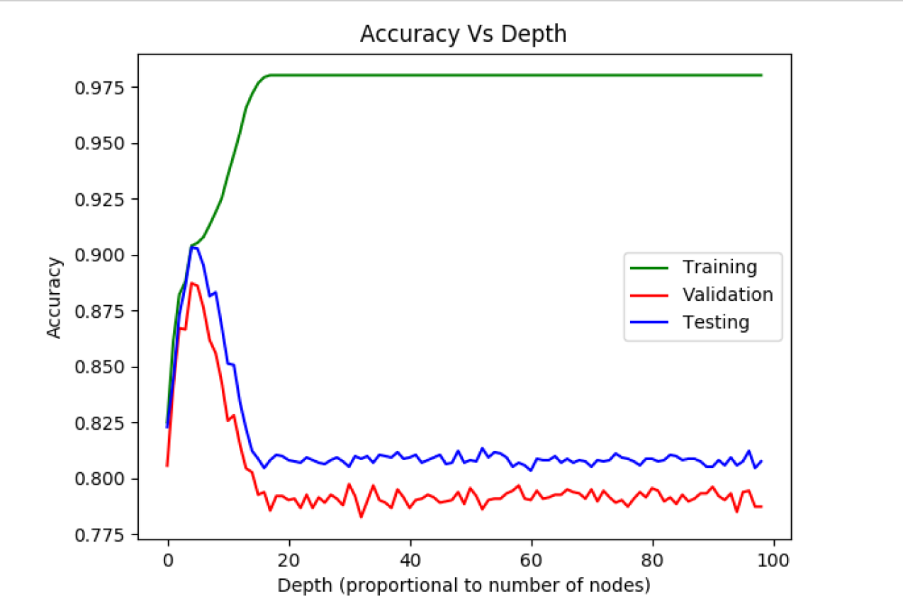

# Decision Trees for Classification

## Introduction
This project explores the construction of decision trees for classification purposes. It involves dividing data into subsets based on different features and recursively constructing a tree from the root.

## Methodology
1. **Splitting Criteria:** The dataset is split based on different features to construct the tree. The splitting continues until each subset becomes pure or reaches a certain depth.
2. **Impurity Measures:** Different impurity measures such as Gini impurity and Information Gain are used to determine the best splitting criterion at each node.
3. **Pruning:** To prevent overfitting, pruning techniques such as post-pruning are employed.

## Results
The decision trees were evaluated based on their accuracy on training, validation, and test datasets.

### Training,Validation & Test Data Accuracy

## Conclusion
The decision trees demonstrated good generalization accuracy, with the best results achieved when the depth of the tree was limited to prevent overfitting.
